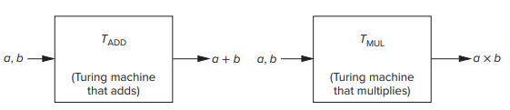
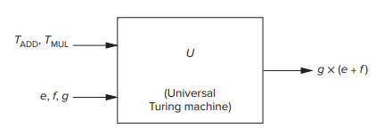

## **1 Введение**

### **1.1 Что мы будем делать**

Наша цель — увидеть, что работа с комьютером — это не магия, и компьютер — это не гений, а машина, выполняющая лишь то, что мы ей скажем.

> Компьютер — детерминизированная система. Если начальные условия одинаковые, одинаковые действия с ним приведут к одинаковым последствиям.

Мы будем выстраивать структуру из блоков подобно зданию, слой за слоем, пока не разберёмся с тем, что такое комьпютер и не научимся писать на языке C.

### **1.2 Как мы дойдём туда**

2 глава — мы увидим, что инфморация представлена в виде 0 и 1, а также научимся производить действия над закодированной в 0 и 1 информацией.

3 глава — мы поймём, что компьютер состоит из частей, по которым идёт (1) или не идёт (0) напряжение. Мы также увидим, что транзисторы составляют микропроцессор, и как эти транзисторы образуют большие структуры для совершения определённых действий (сложение / хранение информации).

4 глава — мы скомбинируем большие структуры (из транзисторов) в машину фон Неймана — базовую машину, описывающую работу компьютера. Мы начнём изучение LC-3 (Little Computer 3).

5 глава — мы продолжим изучение LC-3 — компьютер, который содержит все важные характеристики сегодняшних микропроцессоров без вдавания в сложные подробности.

6 глава — мы начнём программировать на языке LC-3.

7 глава — мы начнём программировать на языке ассемблера.

8 глава — мы будем знакомиться со стэками, очередями, последовательностями символов и учиться внедрять это всё.

9 глава — мы познакомимся с вводом и выводом для LC-3, а также увидим службы, которые предлагает операционная система.

10 глава — мы сделаем симулятор калькулятора.

---

11–20 главы — высокоуровневые языки программирования (С, С++)

11 глава — введение в C и С++.

12 глава — переменные и операторы.

13 глава — алгоритмическая структура.

14 глава — функции.

15 глава — тестирование и отладка.

16 глава — указатели и массивы.

17 глава — рекурсия.

18 глава — ввод и вывод.

19 глава — структуры данных.

20 глава — введение в C++ (главы 11–19 успешно накладываются и на C++)

### 1.3 **Две повторяющиеся темы**

Мы решили выделить 2 важные темы, которые необходимы для полного понимания работы компьютера:

1. Понятие абстракции.
2. Важность отсутствия разделения «железа» и программного обеспечения. 

#### 1.3.1 **Понятие абстракции**

Понятие абстракции помогает упрощённо взаимодействовать с окружающим миром, не вдаваясь лишний раз в подробности (например, при заказе такси можно попросить водителя отвезти пассажира в аэропорт — без необходимости говорить, куда повернуть на каждом перекрёстке)

Пользование абстракциями это хорошо до тех пор, пока всё на нижних (глубоких) уровнях работает. При необходимости разобраться углублённо — необходимо деконструировать уровни абстракции.

!!! Пример
    История про инженера, который взял за «простую» работу очень высокую цену. В чеке было написано: 

    "Turning a screw 35 degrees counterclockwise: $ 0.75

    Knowing which screw to turn and by how much: $ 999.25"

Мы стремимся держаться на самых высоких уровнях абстракций. Без абстракций мы не смогли бы закончить работу над любым изобретением (мы бы думали о составных элементах на каждом уровне, что отвлекало бы).

К деконструированию необходимо прибегать при необходимости описания отдельных компонентов для выявления проблемы на одном из уровней абстракции.

#### 1.3.2 **Железо и программное обеспечение**

Есть «железо» — составные материальные части компьютера и программное обеспечение — любые программы, которыми владеет пользователь компьютера. 

Обычно есть профессионалы в одной из этих двух областях (например, разбираются в «железе»), которые могут обладать минимальными знаниями о другой области (программном обеспечении), и это не считается проблемой.

Мы считаем, что нельзя разделять эти области. Конечно, надо работать на самом высоком уровне абстракции, но чтобы выполнять работу ещё лучше, необходимо знать и нюансы нижних уровней.

Зная возможности и ограничения и «железа», и уровня программного обеспечения, можно максимально эффективно применять эти знания при проектировании компьютеров / работе с ними.

!!! Пример
    Дизайнеры микропроцессоров однажды предположили, что вскоре многие программы будут содержать видеофайлы (email, видеоигры, фильмы), а значит необходимо в «железо» внедрять возможность микропроцессора обрабатывать эти видеофайлы.

### **1.4 Электронная вычислительная машина**

До этого мы использовали слово «компьютер», имея в виду совокупность программного обеспечения и «железа», которое воспроизводит вычисления, требуемые программами. 

Более точное слово для этого «железа» — Центральный Процессор (ЦП), или попросту процессор/микропроцессор. Эта книга в основном о процессоре и программах, которые выполняются процессором.

#### **1.4.1 Немного истории для наглядности**

Одним из первых компьютеров был ЭНИАК (Электронный числовой интегратор и вычислитель — англ. ENIAC, сокр. от Electronic Numerical Integrator and Computer, построенный в 1943–1945 годах в Пенсильвании Джоном Эккертом и Джоном Мокли. 

Прибор занимал огромное количество пространства и состоял из отдельных блоков, которые отвечали за память, вычисления, ввод и вывод результатов. За программирование отвечали несколько операторов, которые занимались включением и выключением проводов/переключателей.

Корпуса интегральной схемы (ИС) развивались стремительно. 

1. Первый микропроцессор Intel 4004 (1971 г.) — впервые уместили ЦП на одну схему, назвали микропроцессором. Содержал 2300 транзисторов, частота 106 кГц.
2. Микропроцессор Intel Pentium (1992 г.) — 3,1 млн транзисторов, частота 66 МГц.
3. Сегодняшние микропроцессоры — 5 млрд транзисторов, частота 4 ГГц.

> Сегодняшний микропроцессор может выполнять 1 млн операций за то же время, за которое в 1971 г. микропроцессор выполнил только одну.

#### **1.4.2 Части компьютерной системы**

Когда люди говорят про «компьютер», они чаще имеют в виду нечто большее, чем просто ЦП — комбинацию элементов, составляющие их компьютерную систему.

Обычно, туда входит:

- ЦП — для производства действий, диктуемых програмнным обеспечением;
- клавиатура — для ввода команд;
- мышь/джойстик — для позиционирования в пунктах меню;
- монитор — для вывода информации, которую произвродит компьютерная система;
- память — для временного хранения информации;
- диски и USB-накопитель — для долгого хранения информации даже после выключения компьютера;
- подключения к другим устройствам (принтер, колонки);
- программное обеспечение.

### **1.5 Две очень важные идеи**

Две важные идеи, лежащие в основе понимания, что есть компьютерные системы:

1. Все компьютеры могут выполнить одинаковое конечное количество вещей. То, что может сделать самый быстрый компьютер, сделает и самый медленный компьютер (при наличии достаточного времени и памяти), просто с другой скоростью.
2. Мы описываем проблемы на наших языках, но в компьютерных системах проблемы решаются потоком электронов. Необходимо перевести проблему с нашего языка в язык напряжения, которое управляет электронами. Этот перевод — это последовательность систематических превращений, развиваемых и улучшаемых за последние годы.

### **1.6 Компьютеры как универсальные вычислительные машины**

Почему мы начинаем учить программирование с понятия «компьютер», ведь, например, инженеры сначала учат основы физики, а потом только как работают двигатели?

Дело в том, что программирование сильно отличается от других дисциплин, и нам надо понять, что компьютеры — это *универсальные вычислительные машины (УВМ)*.

1. Перед тем как появились современные компьютеры, были вычислительные машины — *аналоговые*, которые измеряли какую-то физическую величину (например, логарифмическая линейка). 

2. Потом появились *цифровые* машины, которые производили вычисления над конечным набором чисел или символов. 

Цифровые превосходили аналоговые машины, так как могли легко увеличивать точность (например, в часах добавить измерение тысячных/десятитысячных — для подобного в аналоговых часах пришлось бы делать очень длинную стрелку).

Когда мы говорим о компьютерах в этой книге, мы всегда имеем в виду *цифровые* машины.

Перед появлением современных цифровых компьютеров, самые популярные устройства были — механические или электромеханические машины для сложения/умножения. Были и такие, которые могли упорядочить список в алфавитном порядке.

Проблема была в том, что эти машины могли выполнять только одно конкретное действие.

Компьютеры отличаются тем, что они могут выполнять действия, которые им задаёт пользователь. Если нужно совершить новое действие, не нужно покупать новый компьютер — просто загружаешь новую программу в старый компьютер.

Именно поэтому он называется *универсальной вычислительной машиной*.

> Учёные-компьютерщики верят, что всё что угодно может быть вычислено на компьютере при условии, что есть достаточно времени и памяти.

Идея УВМ принадлежит Алану Тьюрингу — он предложил математическое описание определённого вида машины, теперь называемой «машиной Тьюринга».

Ниже приведены модели «чёрного ящика» — в машину поступают исходные данные, над которыми будет производится определённая операция. Каким образом машина придёт к результату — мы не знаем, может быть множество способов прийти к ответу, но результат будет всегда один и тот же.

> Тезис Тьюринга — любое вычисление может быть выполнено какой-то машиной Тьюринга.

Тьюринг предположил, что может быть такая универсальная машина Тюринга, которой можно будет просто сказать, какие действия должны быть выполнены, и они будут выполнены.

Таким образом, он дал нам первое описание того, что делают компьютеры. И компьютер, и универсальная машина Тьюринга могут вычислить одно и то же (при наличии времени и памяти), если дать им точные инструкции.

