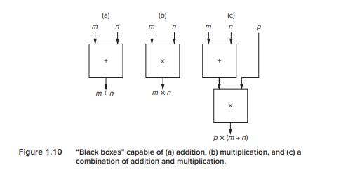
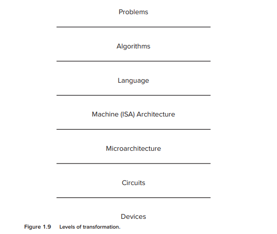

## **Вопросы к 1 главе**

**1.1.** Объясните первую из двух важных идей, изложенных в Разделе 1.5.

Ответ

---

**1.2.** Может ли язык программирования высокого уровня дать компьютеру указание вычислить больше, чем язык программирования низкого уровня?

**1.3.** Какая трудность с аналоговыми компьютерами побуждает разработчиков использовать цифровые решения?

**1.4.** Назовите одну характеристику естественных языков, которая мешает использовать их в качестве языков программирования.

**1.5.** Предположим, у нас есть «черный ящик», который принимает два числа на вход и выдает их сумму (см. Рисунок 1.10a). 

Также у нас есть другой ящик, способный перемножать два числа (см. Рисунок 1.10b). 

Мы можем соединять эти ящики вместе, чтобы вычислить p × (m + n) (см. Рисунок 1.10c). 

Считайте, что у нас есть неограниченное количество таких ящиков. Покажите, как соединить их для вычисления:

  a. ax + b

  b. Среднего арифметического четырех входных чисел w, x, y и z

  c. a² + 2ab + b² (Можете ли вы сделать это, используя только один сумматор и один умножитель?)

**1.6.** Напишите утверждение на естественном языке и предложите два различных толкования этого утверждения.

**1.7.** В обсуждении абстракции в Разделе 1.3.1 отмечалось, что нет необходимости понимать устройство компонентов, пока «с деталями все в полном порядке». Утверждалось, что когда что-то идет не так, необходимо уметь деконструировать компоненты, иначе вы окажетесь во власти абстракций. 

В примере с такси представьте, что вы не понимаете компонент, то есть понятия не имеете, как добраться до аэропорта. Используя понятие абстракции, вы просто говорите водителю: «Отвезите меня в аэропорт». Объясните, когда это повышает продуктивность, а когда может привести к очень негативным последствиям.

**1.8** Джон сказал: «Я видел человека в парке с телескопом». Что он имел в виду? Сколько разумных интерпретаций вы можете дать этому утверждению? Перечислите их. Какое свойство этого предложения делает его неприемлемым в качестве инструкции в программе?

**1.9** Способны ли естественные языки выражать алгоритмы?

**1.10** Назовите три характеристики алгоритмов. Кратко объясните каждую из этих трех характеристик.

**1.11** Для каждой характеристики алгоритма приведите пример процедуры, которая не обладает этой характеристикой и, следовательно, не является алгоритмом.

**1.12** Являются ли пункты a–e в следующем списке алгоритмами? Если нет, каких требуемых от алгоритмов качеств им недостает?

a. Прибавьте первую строку следующей матрицы к другой строке, первый столбец которой содержит ненулевой элемент. (Напоминание: столбцы идут вертикально; строки — горизонтально.)

⎡  1  2  0  4  ⎤

⎢  0  3  2  4  ⎥

⎢  2  3  10 22 ⎥

⎣  12 4  3  4  ⎦

b. Чтобы показать, что простых чисел столько же, сколько натуральных, сопоставьте каждое простое число с натуральным числом следующим образом. Создавайте пары из простых и натуральных чисел, сопоставляя первое простое число с 1 (первым натуральным числом), второе простое число с 2, третье с 3 и так далее. Если в конце окажется, что каждое простое число можно сопоставить с каждым натуральным числом, то будет показано, что простых чисел столько же, сколько натуральных.

c. Предположим, вам даны два вектора, каждый с 20 элементами, и вас просят выполнить следующую операцию: возьмите первый элемент первого вектора и умножьте его на первый элемент второго вектора. Проделайте то же самое со вторыми элементами и так далее. Сложите все полученные произведения, чтобы вычислить скалярное произведение.

d. Линн и Кэлвин пытаются решить, кому идти выгуливать собаку. Линн предлагает подбросить монету и достает из кармана четвертак. Кэлвин не доверяет Линн и подозревает, что монета может быть несимметричной (то есть может благоприятствовать определенному исходу при броске). Он предлагает следующую процедуру для справедливого определения того, кто будет выгуливать собаку.

    1. Подбрось монету дважды.
    2. Если при первом броске выпадет орел, а при втором решка, собаку выгуливаю я.
    3. Если при первом броске выпадет решка, а при втором орел, собаку выгуливаешь ты.
    4. Если оба раза выпадет одно и то же (орел и орел или решка и решка), мы подбрасываем монету еще два раза.

Является ли метод Кэлвина алгоритмом?

e. Дано число. Выполните следующие шаги по порядку:

    1. Умножьте его на 4
    2. Прибавьте 4
    3. Разделите на 2
    4. Вычтите 2
    5. Разделите на 2
    6. Вычтите 1
    7. На этом этапе добавьте 1 к счетчику, чтобы отследить, что вы выполнили шаги 1–6. Затем проверьте результат, который вы получили после вычитания 1. Если он равен 0, запишите, сколько раз вы выполнили шаги 1–6, и остановитесь. Если не 0, начиная с результата вычитания единицы, выполните семь шагов снова.

**1.13** Два компьютера, A и B, идентичны, за исключением того, что у A есть инструкция вычитания, а у B — нет. У обоих есть инструкции сложения. У обоих есть инструкции, которые могут взять значение и получить его отрицательное значение. Какой компьютер способен решить больше задач, A или B? Докажите свой результат.

**1.14** Предположим, мы хотим упорядочить набор имен в алфавитном порядке. Назовем это действие сортировкой. Один из алгоритмов, который может это выполнить, называется пузырьковой сортировкой. Затем мы можем запрограммировать наш алгоритм пузырьковой сортировки на C и скомпилировать программу на C для выполнения на ISA x86. Архитектура ISA x86 может быть реализована с помощью микроархитектуры Intel Pentium IV. Назовем последовательность «Пузырьковая сортировка, программа на C, ISA x86, микроархитектура Pentium IV» одним процессом трансформации.
Предположим, у нас есть четыре алгоритма сортировки, и мы можем программировать на C, C++, Pascal, Fortran и COBOL. У нас есть компиляторы, которые могут транслировать каждый из этих языков либо в x86, либо в SPARC, и у нас есть три различные микроархитектуры для x86 и три различные микроархитектуры для SPARC.

a. Сколько всего возможно процессов трансформации?

b. Напишите три примера процессов трансформации.

c. Сколько процессов трансформации возможно, если вместо трех различных микроархитектур для x86 и трех для SPARC будет две для x86 и четыре для SPARC?

**1.15** Назовите одно преимущество программирования на языке высокого уровня по сравнению с языком низкого уровня. Назовите один недостаток.

**1.16** Назовите как минимум три вещи, которые определяет ISA (архитектура системы команд).

**1.17** Кратко опишите разницу между ISA (архитектурой системы команд) и микроархитектурой.

**1.18** Сколько архитектур системы команд (ISA) обычно реализуется одной микроархитектурой? И наоборот, сколько микроархитектур может существовать для одной ISA?

**1.19** Перечислите уровни трансформации и назовите пример для каждого уровня.

**1.20** Уровни трансформации на рисунке 1.9 часто называют уровнями абстракции. Является ли это разумной характеристикой? Если да, приведите пример. Если нет, то почему?

**1.21** Предположим, вы идете в магазин и покупаете программное обеспечение для обработки текстов. В какой форме на самом деле находится это программное обеспечение? Написано ли оно на языке программирования высокого уровня? На языке ассемблера? В ISA компьютера, на котором вы будете его запускать? Обоснуйте свой ответ.

**1.22** Предположим, вам дали задачу на одном из уровней трансформации, показанных на Рисунке 1.9, и потребовали преобразовать ее на уровень, находящийся непосредственно ниже. На каком уровне было бы труднее всего выполнить преобразование на следующий, более низкий уровень? Почему?

**1.23** Почему ISA вряд ли изменится между последовательными поколениями микроархитектур, которые ее реализуют? Например, почему Intel хочет быть уверенной, что ISA, реализованная в Pentium III, такая же, как и в Pentium II? Подсказка: когда вы обновляете свой компьютер (или покупаете новый с более новым процессором), нужно ли вам выбрасывать все свое старое программное обеспечение?