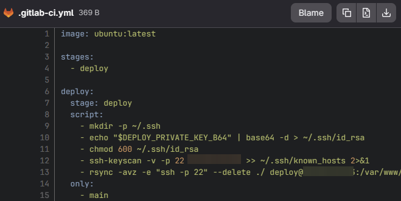

- SSD / HDD + SSD
- NVMe SSD;
- облачный (VPS) и выделенный сервер;
- KVM;
- дистрибутивы;
- IPv6, сеть /64;
- `sudo apt update && sudo apt install virt-what`;
- `sudo virt-what`;
- `systemd-detect-virt`;
- `ip -6 addr show`;
- `ip a | grep inet6`;
- `ping6 google.com` / `ping6 ipv6 google.com`;
- lo (localhost), ens3, docker0, veth...;
- X11 forwarding;
- `sudo apt update && sudo apt upgrade -y`;
- `sudo adduser <name>`;
- `sudo usermod -aG sudo <name>`;
- `sudo nano /etc/ssh/sshd_config` -> PermitRootLogin — `no` -> PasswodAuthentication — `no`; 
- `sudo systemctl restart sshd`;
- `ip a`;
- `cat /etc/resolv.conf`;
- `sudo hostnamectl set-hostname <name>`;
- `sudo nano /etc/hosts` -> 127.0.1.1 AVKL;
- `sudo apt install ufw -y`;
- `sudo ufw allow 22/tcp`;
- `sudo ufw allow 80/tcp`;
- `sudo ufw allow 443/tcp`;
- `sudo ufw enable`;
- `sudo ufw status`;
- `su - <name>`;
- `mkdir -p ~/.ssh` / `sudo mkdir -p ~/.ssh` / `sudo mkdir -p /home/<name>/.ssh` — разница по владельцам;
- `chmod 700 ~/.ssh`;
- `nano ~/.ssh/authorized_keys` -> публичный ключ;
- `chmod 600 ~/.ssh/authorized_keys`;
- `sudo chown -R <name>:<name> /home/<name>/.ssh`;
- `sudo reboot`;
- RSA, Ed2551;
- `sudo grep -i "passwordauthentication" /etc/ssh/sshd_config`;
- `sudo tail -n 20 /var/log/auth.log | grep "Accepted"`;
- `sudo journalctl -u ssh -n 50 | grep "Accepted"`;
- PAM-аутентификация;
- `sudo grep -n "PasswordAuthentication" /etc/ssh/sshd_config | grep -v "#"`;
- `sudo grep -n "password" /etc/ssh/sshd_config | grep -v "^#"`;
- `sudo sshd -T | grep passwordauthentication`;
- `sudo grep -i "include" /etc/ssh/sshd_config`;
- `ls -la /etc/ssh/sshd_config.d/`;
- `sudo sshd -T -C user=admin-ars | grep passwordauthentication`;
- `sudo rm /etc/ssh/sshd_config.d/99-disable-passwords.conf`;
- `sudo hostnamectl set-hostname <name>`;
- `hostnamectl`;
- `sudo v`;
- `sudo apt update && sudo apt install nginx -y`;
- `sudo systemctl status nginx`;
- `sudo nginx -t`;
- NGINX;
- SSL-сертификат;
- 80 и 443 порты;
- `sudo apt install git -y`;
- `git version`;
- `git config -- global user.name "NAME"`;
- `git config -- global user.email "email@example.com`;
- `git config -- list`;
- `dpkg -l | grep ufw`;
- `sudo apt autoremove -y`;
- efibootmgr;
- mokutil;
- Node.js;
- npm;
- Nginx;
- Docker
- `sudo apt install nginx -y`;
- `sudo systemctl status nginx`;
- `sudo systemctl enable nginx`;
- `sudo apt install -y ca-certificates curl`;
- `sudo install -m 0755 -d /etc/apt/keyrings`;
- GPG-ключ;
- `sudo curl -fsSL https://download.docker.com/linux/ubuntu/gpg -o /etc/apt/keyrings/docker.asc`;
- `sudo chmod a+r /etc/apt/keyrings/docker.asc`;
- список источников APT;
- `sudo apt install -y docker-ce docker-ce-cli containerd.io docker-buildx-plugin docker-compose-plugin`;
- `sudo systemctl status docker`;
- `sudo apt install nodejs npm -y`;
- пояснить, почему в `sudo install -m 0755 -d /etc/apt/keyrings` 0 в начале, если мы говорили, что 3 цифры для доступов? и 7 первая для админа;
- `echo ... | sudo tee /etc/apt/sources.list.d/docker.list`;
- `docker pull postgres:16`;
- `docker images`;

- ```docker run -d \
  --name postgres-server \
  -e POSTGRES_PASSWORD=mysecretpassword \
  -e POSTGRES_USER=admin \
  -e POSTGRES_DB=myapp \
  -p 5432:5432 \
  --restart unless-stopped \
  postgres:1
  ```

- `docker ps`;
- `docker exec -it postgres-server psql -U admin -d myapp`;
- `-v postgres-data:/var/lib/postgresql/data` - внутри кода для `docker run -d \ ....`;
- `docker exec -it postgres-server psql -U admin -d postgres`;
- `CREATE USER ____ WITH SUPERUSER PASSWORD ....`;
- `\du`;
- `sudo mkdir -p /etc/nginx/ssl`;
- ```sudo openssl req -x509 -nodes -days 365 -newkey rsa:2048 \
  -keyout /etc/nginx/ssl/selfsigned.key \
  -out /etc/nginx/ssl/selfsigned.crt \
  -subj "/C=RU/ST=Moscow/L=Moscow/O=MyCompany/CN=IP"```;
- что делаем командой и что в файле пишем `sudo nano /etc/nginx/sites-available/default`;
- `sudo nginx -t`;
- `sudo nginx -t`;
- `sudo systemctl restart nginx`;
- `ls -la /var/www/html/`;
- `sudo chown -R www-data:www-data /var/www/html`;
- `sudo chmod -R 755 /var/www/html`;
- образ и контейнер;
- `sudo adduser deploy`;
- `sudo mkdir -p /var/www/myapp`;
- `sudo chown deploy:deploy /var/www/myapp`;
- `sudo -v`;
- scope link, scope global;
- `curl -fsSL https://packages.gitlab.com/install/repositories/gitlab/gitlab-ce/script.deb.sh | sudo bash`;
- `sudo EXTERNAL_URL="http://IP:8888" apt install gitlab-ce`;
- `sudo gitlab-ctl status`;
- `sudo cat /etc/gitlab/initial_root_password`;
- `base64 -w0 gitlab_ci_key` в Git Bash;
- .gitlab-ci.yml без docker compose - какие команды пишем и почему:



- `curl -L --output /usr/local/bin/gitlab-runner https://gitlab-runner-downloads.s3.amazonaws.com/latest/binaries/gitlab-runner-linux-amd64`;
- `chmod +x /usr/local/bin/gitlab-runner`;
- `sudo useradd --comment 'GitLab Runner' --create-home gitlab-runner --shell /bin/bash`;
- `sudo /usr/local/bin/gitlab-runner install --user=gitlab-runner --working-directory=/home/gitlab-runner`;
- `sudo /usr/local/bin/gitlab-runner start`;
- `sudo gitlab-runner register --url http://IP/:8888 --token glrt-xxxxxxxxxxxxxxxx`;
- `mv ~/.bash_logout ~/.bash_logout.bak` — что в файле содержится, почему переименовывали.